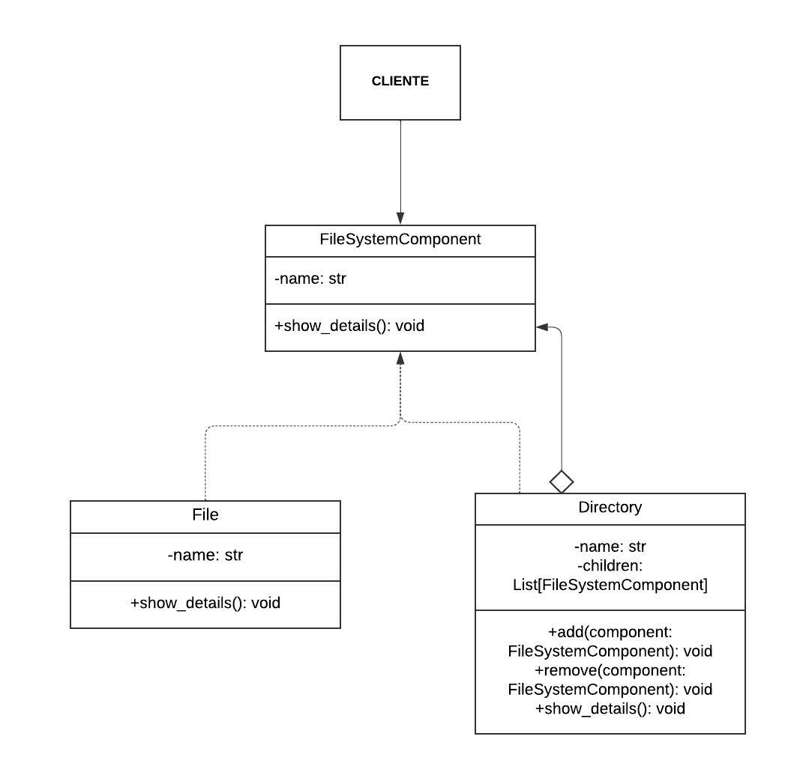

# BCC3004-Padroes-de-Projeto

"Padrões de projeto são soluções típicas para problemas comuns em projeto de software. Eles são como plantas de obra pré fabricadas que você pode customizar para resolver um problema de projeto recorrente em seu código."

## Padrão Criacional 

 Fornecem mecanismos de criação de objetos que aumentam a flexibilidade e a reutilização de código.
 O padrão criacional mais cobrado em concursos publicos é o Singleton, também conhecido como: Carta única
 
## Singleton     
O padrão de projeto SINGLETON garante à exitência de apenas uma instância de uma classe mantendo um ponto global de acesso ao seu objeto.
Este padrão é útil quando uma classe precisa ter exatamente uma instância ativa em todo o sistema para controlar o acesso a um recurso compartilhado ou gerenciar estados globais. Dessa forma então vamos imaginar um problema e uma solução para exemplificar o uso do singleton:

## Problema
Um aplicativo precisa carregar suas configurações de um arquivo JSON apenas uma vez e compartilhar essa configuração entre todos os componentes do sistema. Múltiplas instâncias de configuração podem resultar em inconsistência de dados e comportamento inesperado.

## Solução
Usar o padrão Singleton para garantir que a configuração seja carregada uma única vez e compartilhada globalmente.


## Diagrama UML
 


## Código
A classe `Config` carrega a configuração de um arquivo JSON na primeira vez que é instanciada. Todas as chamadas subsequentes usam a mesma instância de configuração.

### Arquivo `config_singleton.py`

```python
# config_singleton.py
import json

class Config:
    _instance = None

    def __new__(cls, *args, **kwargs):
        if not cls._instance:
            cls._instance = super().__new__(cls, *args, **kwargs)
            cls._instance._load_config()
        return cls._instance

    def _load_config(self):
        try:
            with open('config.json', 'r') as f:
                self._config = json.load(f)
        except FileNotFoundError:
            self._config = {
                "database": "MySQL",
                "host": "localhost",
                "port": 3306
            }

    def get_config(self):
        return self._config

    def update_config(self, key, value):
        self._config[key] = value
        with open('config.json', 'w') as f:
            json.dump(self._config, f, indent=4) 
``` 
## Padrão Estrutural 

Se preocupam com a forma como os objetos são compostos para formar
estruturas maiores.

## Composite

Compor objetos em estruturas de árvore para representar hierarquias partes/todo.
Composite permite aos clientes tratarem de maneira uniforme objetos individuais e composições de objetos.

## Problema 
Necessidade de tratar e manipular uma hierarquia de arquivos e diretórios de maneira uniforme. Em um sistema de arquivos, pastas (diretórios) podem conter tanto outros diretórios quanto arquivos, criando uma estrutura de árvore. Queremos uma solução que permita adicionar, remover e exibir esses elementos hierárquicos sem a necessidade de distinguir entre arquivos e diretórios no código que os manipula.

## Solução 
A solução utilizada é o padrão de design Composite, que permite tratar objetos individuais e composições de objetos de forma uniforme. Através desse padrão, criamos uma interface comum FileSystemComponent que define operações genéricas aplicáveis a todos os componentes da hierarquia. Implementamos duas classes concretas: File, que representa os arquivos, e Directory, que representa os diretórios.

## Diagrama Composite

  

## Código 

- Criação de Arquivos e Diretórios: Instanciamos objetos das classes File e Directory.
- Composição da Hierarquia: Utilizamos o método add da classe Directory para adicionar arquivos e outros diretórios à hierarquia.
- Exibição da Estrutura: Chamamos o método show_details no diretório raiz (dir2), que recursivamente chama show_details em todos os seus componentes filhos, exibindo assim toda a estrutura de arquivos e diretórios.

### Arquivo `composite.py`

```python 
#composite.py 
from typing import List

class FileSystemComponent:
    def __init__(self, name: str):
        self.name = name

    def show_details(self):
        raise NotImplementedError("Subclasses must implement this method")


class File(FileSystemComponent):
    def show_details(self):
        print(f"File: {self.name}")


class Directory(FileSystemComponent):
    def __init__(self, name: str):
        super().__init__(name)
        self.children: List[FileSystemComponent] = []

    def add(self, component: FileSystemComponent):
        self.children.append(component)

    def remove(self, component: FileSystemComponent):
        self.children.remove(component)

    def show_details(self):
        print(f"Directory: {self.name}")
        for child in self.children:
            child.show_details()
```

## Padrão Comportamentais 
Os padrões comportamentais se concentram em como os objetos interagem e se comunicam. 

## Command

O padrão Command é um dos padrões comportamentais mais utilizados. Ele encapsula uma solicitação como um objeto, permitindo que você parametrize clientes com filas, solicitações e operações. Isso também facilita a implementação de desfazer operações.

## Problema
O padrão Command resolve vários problemas comuns em sistemas de software, especialmente aqueles relacionados à separação de responsabilidades e à flexibilidade na execução de ações. Alguns dos problemas específicos que o padrão Command aborda são:
- Encapsulamento de Solicitações como Objetos
- Parametrização de Objetos com Ações
- Fila de Solicitações e Operações Desfazer/Refazer

## Solução 
O padrão Command oferece uma solução elegante e flexível para esses problemas encapsulando solicitações como objetos. Aqui estão alguns dos principais benefícios e como o padrão Command os realiza:
- Desacoplamento Entre Solicitante e Executante
- Facilidade de Adição de Novas Comandos
- Implementação de Filas de Comandos
- Suporte para Operações Desfazer/Refazer

## Diagrama Command

  

## Código
Vamos considerar um exemplo prático: um sistema de controle remoto para um dispositivo de luz. O controle remoto pode ligar e desligar a luz. Utilizando o padrão Command, podemos encapsular as ações de ligar e desligar a luz em comandos separados.

### Arquivo `command.py`

```python 
#command.py
# Command Interface
class Command:
    def execute(self):
        pass

# Receiver
class Light:
    def on(self):
        print("The light is on")

    def off(self):
        print("The light is off")

# Concrete Command for turning on the light
class LightOnCommand(Command):
    def __init__(self, light: Light):
        self.light = light

    def execute(self):
        self.light.on()

# Concrete Command for turning off the light
class LightOffCommand(Command):
    def __init__(self, light: Light):
        self.light = light

    def execute(self):
        self.light.off()

# Invoker
class RemoteControl:
    def __init__(self):
        self.command = None

    def set_command(self, command: Command):
        self.command = command

    def press_button(self):
        self.command.execute()

# Client code
if __name__ == "__main__":
    light = Light()
    light_on = LightOnCommand(light)
    light_off = LightOffCommand(light)

    remote = RemoteControl()

    # Turn the light on
    remote.set_command(light_on)
    remote.press_button()

    # Turn the light off
    remote.set_command(light_off)
    remote.press_button()
``` 
